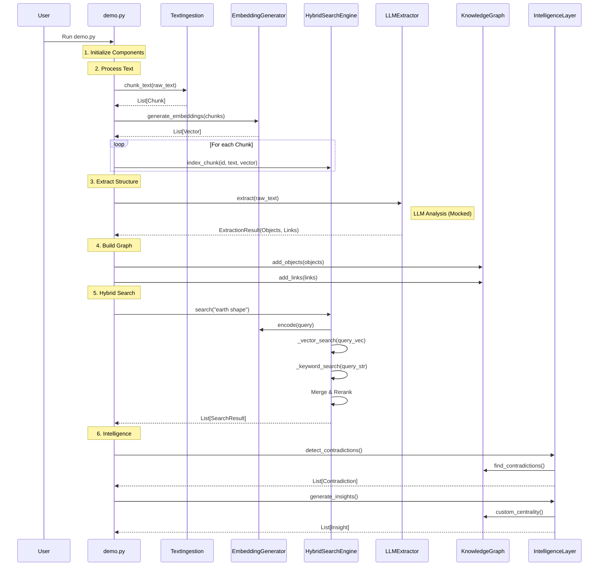

# Note Agent ML Workflow

This document explains the execution flow of the Note Agent's Machine Learning pipeline, detailing how data is transformed and how functions interact.

## High-Level Data Flow

The pipeline follows a linear transformation process:
`Raw Text` → `Chunks` & `Embeddings` → `Structured Objects` → `Knowledge Graph` → `Search` & `Insights`

## Execution Flow (Mermaid)

## Execution Flow (Text Diagram)

For editors that do not support Mermaid, here is the text-based flow:

1. **[User]** runs `demo.py`
2. **[Demo]** calls `extract_text_task(note_id)`
   - Returns: Extracted/cleaned text
3. **[Demo]** calls `chunk_text_task(note_id)`
   - Returns: Span records written to storage
4. **[Demo]** indexes chunks into `HybridSearchEngine`
5. **[Demo]** calls `LLMExtractor.extract(raw_text)`
   - Returns: Structured Objects (Ideas, Claims) and Links
6. **[Demo]** calls `KnowledgeGraph.add_objects()` and `add_links()`
   - Builds the graph structure
7. **[Demo]** calls `HybridSearchEngine.search("query")`
   - Performs Vector Search + Keyword Search -> Merges Results
   - Returns: Ranked Search Results
8. **[Demo]** calls `IntelligenceLayer.generate_insights()`
   - Analyzes Graph (Centrality, Stale Threads)
   - Returns: List of Insights

## Detailed Function Call Breakdown

### 1. Extraction + Chunking Tasks (`ml/extraction_tasks.py`)
- **`extract_text_task(note_id)`**:
  - **Input**: Note id with file metadata.
  - **Process**: Extracts text by file type (PDF/DOCX/image/text), cleans it, and writes `derived/.../extracted.txt`.
  - **Output**: Cleaned text.
- **`chunk_text_task(note_id, window_size, overlap)`**:
  - **Input**: Note id with extracted/cleaned text.
  - **Process**: Sentence segmentation with spaCy, token windowing with `tiktoken`, writes `derived/.../chunks.jsonl`.
  - **Output**: Span records in DB + chunk jsonl.

### 2. Search Indexing (`ml/search.py`)
- **`index_chunk(id, text, vector)`**:
  - **Process**: Stores the chunk text and its vector in an in-memory list (`self.chunks`). In production, this would write to `pgvector`.

### 3. Extraction (`ml/extraction.py`)
- **`extract(text)`**:
  - **Input**: Raw string.
  - **Process**: Prompts an LLM (currently mocked with keyword heuristics) to identify:
    - **Objects**: Concepts like Ideas, Claims, Evidence.
    - **Links**: Relationships like Supports, Contradicts.
  - **Output**: `ExtractionResult` containing typed Pydantic models.

### 4. Knowledge Graph (`ml/graph.py`)
- **`add_objects(objects)`**: Adds nodes to the NetworkX graph.
- **`add_links(links)`**: Adds directed edges with types (e.g., `Supports`) to the graph.

### 5. Hybrid Search (`ml/search.py`)
- **`search(query)`**:
  1.  **Vector Search**: Embeds the query and finds nearest neighbor chunks (Semantic match).
  2.  **Keyword Search**: Counts keyword overlaps (Exact match).
  3.  **Fusion**: Merges results, boosting scores if found in both.

### 6. Intelligence (`ml/intelligence.py`)
- **`generate_insights()`**:
  - **Process**: Analyzes the graph structure.
  - **Centrality**: Calculates `degree_centrality` (how connected a node is) to identify "Core Concepts".
  - **Staleness**: Checks for "Questions" with no outgoing edges (unanswered).
